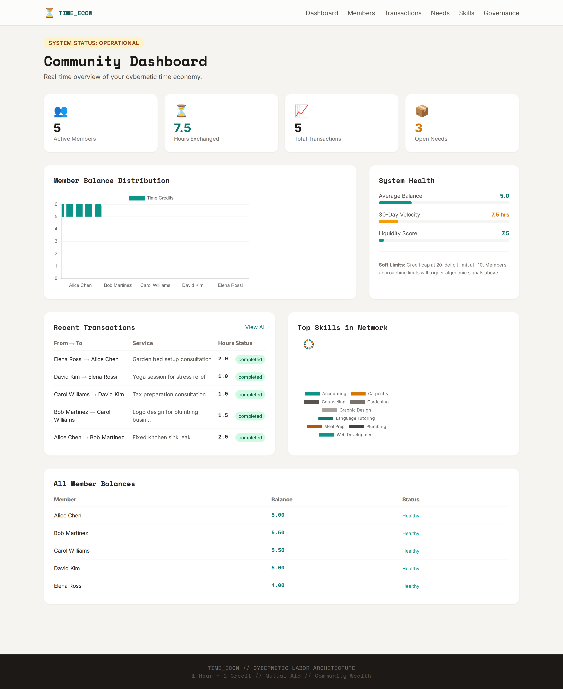
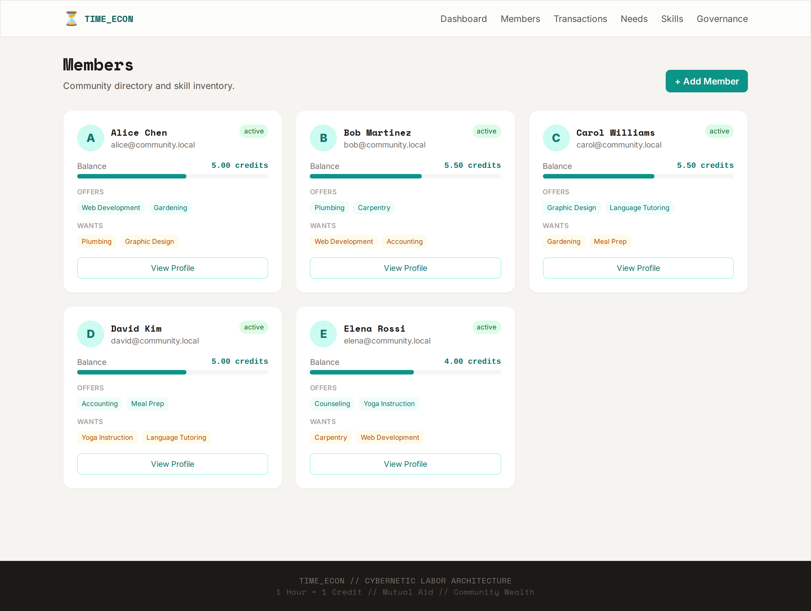
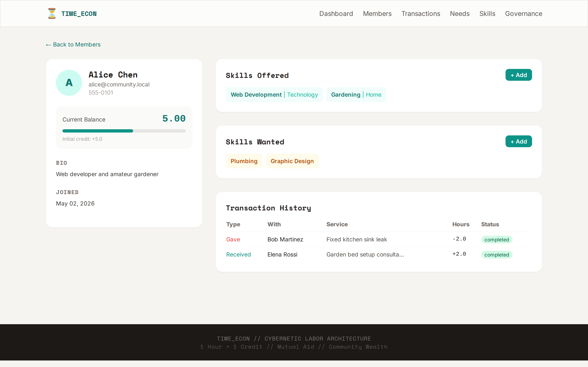
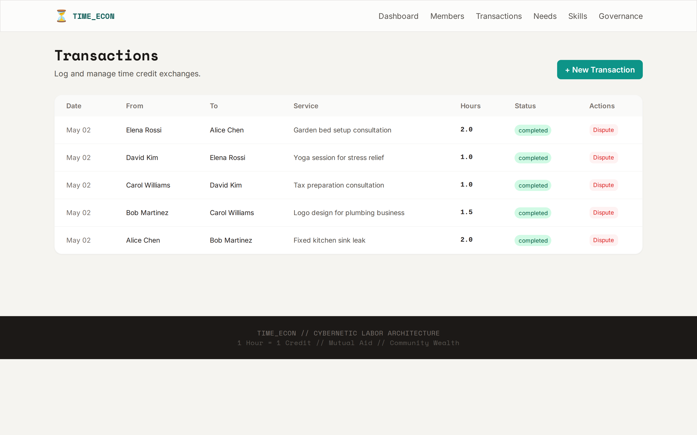
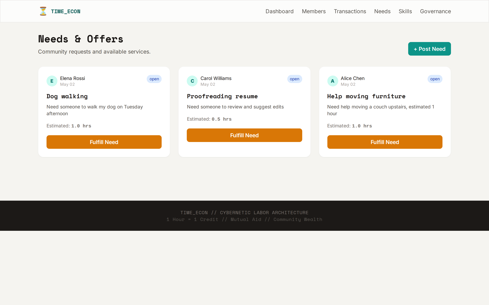
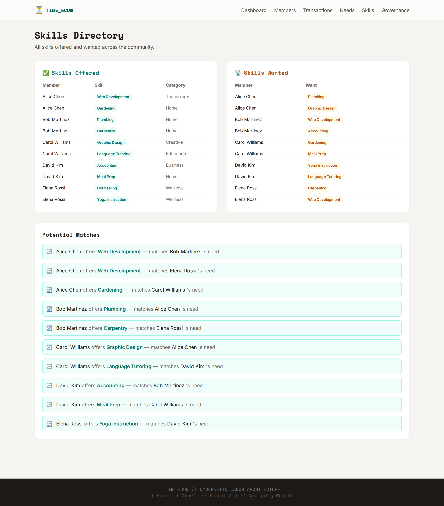
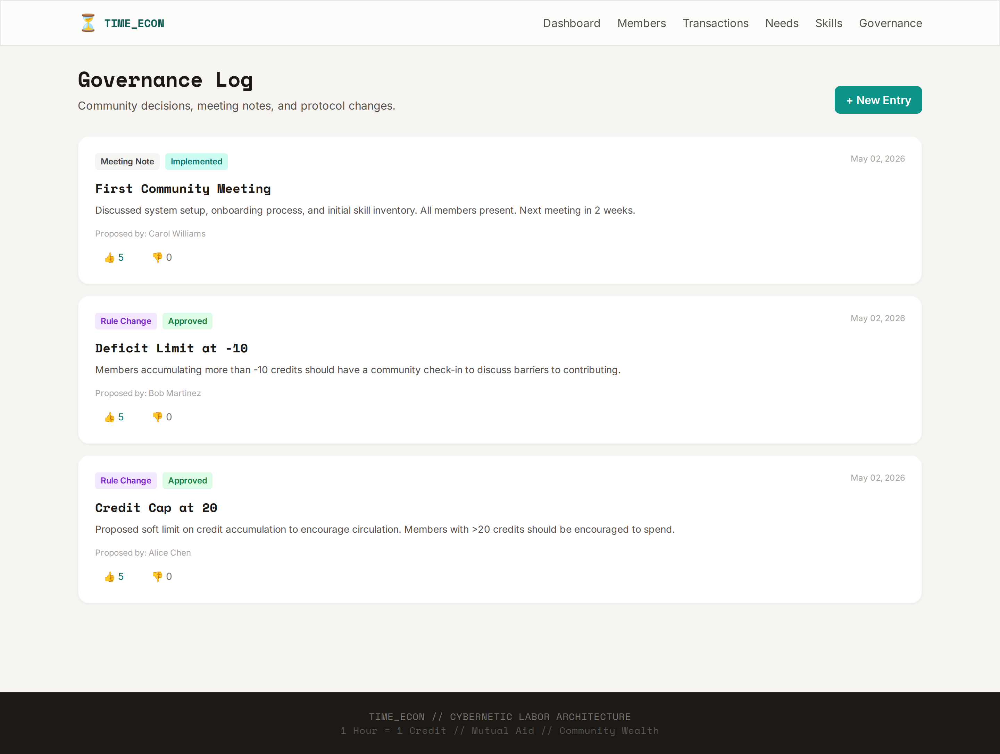

# Time Economy - Cybernetic Labor Market

A web application for implementing a time-based economy in small communities (5-10 people), based on the principles of timebanking, cybernetic governance (Viable System Model), and platform cooperativism.

## Core Principles

- **1 Hour = 1 Credit**: All human time is valued equally
- **Mutual Credit**: Non-circulating time credits, no fiat conversion
- **Transparent Governance**: Community-driven decisions with full transparency
- **Algedonic Signals**: Automatic alerts when members approach credit/deficit limits

## Features

- **Member Directory**: Manage community members with skill inventories
- **Transaction Logging**: Record time credit exchanges with status tracking
- **Balance Dashboard**: Real-time view of all member balances with visual indicators
- **Needs Board**: Post and fulfill community service requests
- **Governance Log**: Track decisions, votes, and meeting notes
- **Skills Matching**: Automatic identification of skill/want matches
- **System Health Metrics**: Monitor liquidity, velocity, and circulation

## Screenshots

### Dashboard


### Members


### Member Detail


### Transactions


### Needs & Offers


### Skills Directory


### Governance Log


## Quick Start

### Option 1: Docker (Recommended)

```bash
cd time_econ_app
docker-compose up -d
```

The app will be available at `http://localhost:8000`

### Option 2: Local Python

```bash
cd time_econ_app
python -m venv venv
source venv/bin/activate  # On Windows: venv\Scripts\activate
pip install -r requirements.txt
uvicorn app.main:app --reload
```

The app will be available at `http://localhost:8000`

## System Architecture (VSM)

The application implements Stafford Beer's Viable System Model:

- **System 1 (Operations)**: Individual members self-scheduling and exchanging
- **System 2 (Coordination)**: Transaction logging, conflict resolution protocols
- **System 3 (Control)**: Real-time balance monitoring, credit caps (20/-10)
- **System 4 (Intelligence)**: Dashboard metrics, skill gap analysis
- **System 5 (Policy)**: Governance log with voting mechanisms

## Economic Mechanisms

- **Egalitarian Valuation**: All services valued at 1 hour = 1 credit
- **Initial Credit**: New members receive 5 credits to get started
- **Soft Limits**: 
  - Credit cap at 20 (hoarding alert)
  - Deficit limit at -10 (community check-in)
- **Social Demurrage**: Community encouragement to spend credits rather than hoard

## First Steps

1. Add your community members via the Members page
2. Have each member list their skills and wants
3. Start logging transactions when services are exchanged
4. Monitor the dashboard for system health and algedonic signals
5. Use the Governance log for community decisions

## Data Storage

All data is stored in a local SQLite database (`time_economy.db`). Back up this file regularly.

## Terminal Interfaces (No Browser Required!)

For communities without reliable internet or modern computers, we provide three terminal-based interfaces that share the same database as the web app:

### 1. Rich TUI (Text User Interface)

A full-screen interactive terminal application with tables, forms, and keyboard navigation.

```bash
python -m app tui
```

**Keyboard shortcuts:**
- `d` - Dashboard
- `m` - Members
- `t` - Transactions
- `n` - Needs
- `g` - Governance
- `s` - Skills
- `r` - Refresh data
- `q` - Quit

### 2. Plain-Text Menu Interface

A simple numbered-menu interface designed for low-tech environments. Works on any terminal, even old computers and basic Windows CMD.

```bash
python -m app cli
```

### 3. Command-Line Interface

Scriptable commands for automation and quick operations.

```bash
# Dashboard
python -m app cmd dashboard

# Members
python -m app cmd members list
python -m app cmd members add "John Doe" "john@example.com"
python -m app cmd members show 1

# Transactions
python -m app cmd tx list
python -m app cmd tx create --from 1 --to 2 --hours 2.5 "Garden help"
python -m app cmd tx complete 6

# Needs
python -m app cmd needs list
python -m app cmd needs create --member 1 "Help moving" "Need help moving furniture" --hours 3

# Governance
python -m app cmd gov list
python -m app cmd gov vote 1 for

# Skills
python -m app cmd skills
```

### Data Export

Both terminal interfaces support exporting data for backup and sharing:

- **CSV** - Open in Excel or LibreOffice Calc
- **JSON** - Machine-readable backup
- **Plain Text** - Printable reports

Use the Export option in the menu interfaces, or access the data directly from `time_economy.db`.

## Technology Stack

- **Backend**: FastAPI (Python)
- **Database**: SQLite (via SQLAlchemy)
- **Frontend**: Jinja2 templates with Tailwind CSS
- **Charts**: Chart.js
- **TUI**: Textual (Python)
- **CLI**: Typer + Rich (Python)

## License

MIT License - Use freely for your community.
